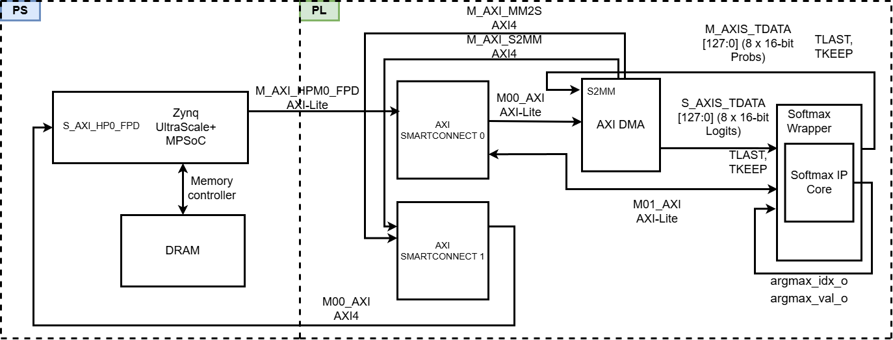

# Hardware Implementation of Softmax IP Core on FPGA Kria KV260

<p align="center">
  
</p>

<p align="center">
  <a href="https://www.xilinx.com/products/boards-and-kits/kria/kv260.html">
    
  </a>
  
  
  
  
  
  
</p>

---

**Tác giả:** Lê Minh Đức — MSSV: 2470451  
**Người hướng dẫn:** PGS. TS. Trương Quang Vinh  
**Cơ sở đào tạo:** Trường Đại học Bách Khoa, ĐHQG-TP.HCM  
**Năm:** 2026

> **Luận văn Thạc sĩ:** *Thiết kế và Thực thi Lõi Gia tốc Softmax trên Nền tảng FPGA Kria KV260*

---

## Mục lục

1. [Tổng quan](#1-tổng-quan)
2. [Kiến trúc hệ thống](#2-kiến-trúc-hệ-thống)
3. [Yêu cầu hệ thống](#3-yêu-cầu-hệ-thống)
4. [Cấu trúc repository](#4-cấu-trúc-repository)
5. [Hướng dẫn sử dụng](#5-hướng-dẫn-sử-dụng)
6. [Kết quả thực nghiệm](#6-kết-quả-thực-nghiệm)
7. [Báo cáo Vivado](#7-báo-cáo-vivado)
8. [Trích dẫn](#8-trích-dẫn)
9. [Giấy phép](#9-giấy-phép)

---

## 1. Tổng quan

Repository này chứa toàn bộ mã nguồn phần cứng (RTL Verilog), phần mềm kiểm thử (PYNQ/Jupyter Notebook), và báo cáo triển khai (Vivado Synthesis, Timing, Power) đi kèm luận văn thạc sĩ:

> *"Thiết kế và Thực thi Lõi Gia tốc Softmax trên Nền tảng FPGA Kria KV260"*

**IP Softmax v6.0 — Block-Scan Lookahead** là lõi IP tính hàm Softmax dạng streaming theo kiến trúc 2 lần duyệt (2-Pass), sử dụng số học dấu chấm tĩnh (fixed-point Q4.12/Q1.15), loại bỏ hoàn toàn DSP slice và đạt tần số hoạt động 333 MHz trên Kria KV260.

**Đóng góp chính:**

| Đặc điểm | Mô tả |
|---|---|
| Kiến trúc | Block-Scan Lookahead, 2-Pass streaming, 9 trạng thái FSM, 9-stage pipeline |
| Giao diện | AXI4-Stream 128-bit (8 phần tử/nhịp), AXI4-Lite (thanh ghi điều khiển) |
| Exp2 Unit | BRAM ROM LUT + Taylor bậc 1, định dạng Q4.12 |
| Bộ nhân | Booth Radix-4 + Wallace Tree (CSA + CLA), không dùng DSP |
| Nghịch đảo | PWL tuyến tính từng đoạn, LOD 2 pha, 64/128/256 đoạn |
| Tài nguyên | ~10,200 LUT, ~8,800 FF, **0 DSP**, 2 BRAM36K |
| Tần số | **333 MHz** (Kria KV260, Vivado 2024.2) |
| Độ trễ | 21 chu kỳ pipeline (scan 3 + exp2 6 + CSA 1 + Booth 9 + shift 1 + clamp 1) |

---

## 2. Kiến trúc hệ thống

```
                     AXI4-Stream Input (128-bit, 8×Q4.12)
                              │
                    ┌─────────▼──────────┐
                    │    scan_fifo       │  ← BRAM-based, BLOCK_SIZE=16 beats
                    │ (Block-Scan Look.) │
                    └─────────┬──────────┘
                              │ Block Max
               ┌──────────────▼─────────────────┐
               │          PASS 1 Pipeline        │
               │  exp2(6) → CSA(1) → Booth(9)   │  ← sum_exp accumulator 48-bit
               │  → shift(1) → clamp(1)         │
               └──────────────┬─────────────────┘
                              │ p1_done / auto_p2_en
               ┌──────────────▼─────────────────┐
               │          PASS 2 Pipeline        │
               │  Re-stream → exp2 × recip_pwl  │  ← Q1.15 output
               └──────────────┬─────────────────┘
                              │
                    AXI4-Stream Output (128-bit, 8×Q1.15)

     AXI4-Lite ──► softmax_dl2_slave_lite  ──► k_config, start, status
```

**2 chế độ hoạt động:**
- **Auto-P2:** IP tự chuyển Pass 1 → Pass 2 qua `auto_p2_en`, không cần CPU can thiệp.
- **Manual-P2:** CPU kiểm tra `p1_done`, ghi `start_p2` để kích hoạt Pass 2.

---

## 3. Yêu cầu hệ thống

### Phần cứng

| Thành phần | Yêu cầu |
|---|---|
| FPGA Board | Xilinx Kria KV260 Vision AI Starter Kit |
| Chip | Zynq UltraScale+ MPSoC XCK26 |
| RAM | 4 GB DDR4 (trên KV260 SOM) |

### Phần mềm (máy host)

| Phần mềm | Phiên bản |
|---|---|
| Vivado ML Edition | 2024.2 |
| Python | ≥ 3.8 |
| PYNQ | v3.0 |
| Jupyter Notebook | ≥ 6.4 |
| numpy, torch, torchvision | (xem `sw_src/requirements.txt`) |

---

## 4. Cấu trúc repository

```
softmax-kv260/
│
├── hw_src/                        # Mã nguồn RTL Verilog
│   ├── softmax_ip_v6.v            # Top-level IP: Block-Scan Lookahead
│   ├── softmax_dl2_v6.v           # Wrapper tích hợp AXI4-Stream + AXI4-Lite
│   ├── softmax_dl2_slave_lite_v1_0_S00_AXI.v  # AXI4-Lite slave (thanh ghi điều khiển)
│   ├── exp2_base2_v2.v            # Đơn vị exp2: BRAM ROM + Taylor bậc 1
│   ├── mul16x16_booth4_nodsp_axis.v  # Bộ nhân Booth Radix-4 + Wallace Tree (0 DSP)
│   ├── pwl_reciprocal_v2.v        # PWL nghịch đảo: LOD 2 pha + nội suy tuyến tính
│   ├── scan_fifo.v                # FIFO phân tán (LUTRAM) cho Block-Scan Lookahead
│   ├── csa_cla_add4_32bit.v       # CSA + CLA 4-to-2 compressor, 32-bit
│   └── csa_cla_add8_32bit.v       # CSA + CLA 8-to-2 compressor, 32-bit
│
├── sim/                           # Testbench mô phỏng
│   └── tb_softmax_v6.sv           # SystemVerilog testbench (tự kiểm tra argmax, MAE, KL)
│
├── sw_src/                        # Phần mềm kiểm thử trên PYNQ
│   ├── test_pure_softmax_v6.ipynb # Kiểm thử thuần IP: K=10÷1024, đa kịch bản
│   ├── test_mnist_v6.ipynb        # Kiểm thử end-to-end: MNIST (K=10)
│   ├── test_cifar100_v6.ipynb     # Kiểm thử end-to-end: CIFAR-100 (K=100)
│   ├── test_imagenet_v6.ipynb     # Kiểm thử end-to-end: ImageNet-1K (K=1000→1024)
│   └── requirements.txt           # Thư viện Python cần thiết
│
├── results/                       # Dữ liệu kết quả thực nghiệm (CSV)
│   ├── pure_softmax_v6_earlystop.csv   # Kết quả kiểm thử thuần IP (5600 mẫu)
│   ├── mnist_v6_hw.csv                 # Kết quả MNIST (10,000 mẫu)
│   ├── cifar100_v6_hw.csv              # Kết quả CIFAR-100 (10,000 mẫu)
│   └── imagenet_v6_hwil.csv            # Kết quả ImageNet-1K (10,000 mẫu)
│
├── rpt/                           # Báo cáo Vivado
│   ├── synthesis/
│   │   └── utilization_synth.rpt  # Tài nguyên sau synthesis
│   │   
│   ├── timing/
│   │   └── timing_summary.rpt     # Timing summary (WNS, TNS, WHS)
│   │   
│   └── power/
│       └── power_summary.rpt      # Power summary (tổng, động, tĩnh)
│       
│
├── docs/                          # Tài liệu bổ sung
│   ├── figures/                   # Hình ảnh sơ đồ kiến trúc
│   │   ├── block_diagram_overview.png
│   │   └── microarchitecture_full.png
│   └── register_map.md            # Bản đồ thanh ghi AXI4-Lite
│
├── .gitignore
├── LICENSE
└── README.md
```

---

## 5. Hướng dẫn sử dụng

### Bước 1: Chuẩn bị bitstream

Nếu chưa có file bitstream, mở Vivado 2024.2 và tổng hợp từ mã nguồn RTL:

```bash
# Mở Vivado, tạo project mới, thêm toàn bộ file trong hw_src/
# Chạy: Run Synthesis → Run Implementation → Generate Bitstream
# File output: my_softmax15.bit + my_softmax15.hwh
```

Hoặc tải bitstream đã được tổng hợp sẵn từ [Releases](../../releases).

### Bước 2: Sao chép file lên KV260

```bash
# Từ máy host (Linux/Windows)
scp my_softmax15.bit my_softmax15.hwh xilinx@<kv260-ip>:/home/xilinx/jupyter_notebooks/
scp sw_src/*.ipynb  xilinx@<kv260-ip>:/home/xilinx/jupyter_notebooks/
scp results/*.csv   xilinx@<kv260-ip>:/home/xilinx/jupyter_notebooks/
```

### Bước 3: Mở Jupyter Notebook trên KV260

Truy cập giao diện PYNQ qua trình duyệt:

```
http://<kv260-ip>:9090
# Mật khẩu mặc định: xilinx
```

### Bước 4: Chạy notebook kiểm thử

Mở notebook phù hợp và chạy tuần tự từng cell:

| Notebook | Mục đích | K |
|---|---|---|
| `test_pure_softmax_v6.ipynb` | Kiểm thử IP thuần túy, đa kịch bản | 10 ÷ 1024 |
| `test_mnist_v6.ipynb` | Kiểm thử trên tập MNIST | 10 |
| `test_cifar100_v6.ipynb` | Kiểm thử trên tập CIFAR-100 | 100 |
| `test_imagenet_v6.ipynb` | Kiểm thử trên tập ImageNet-1K | 1000 → 1024 |

**Lưu ý:** Cell đầu tiên của mỗi notebook nạp overlay (bitstream) và khởi tạo IP. Đảm bảo file `.bit` và `.hwh` nằm cùng thư mục với notebook.

---

## 6. Kết quả thực nghiệm

### 6.1. Tài nguyên phần cứng (Kria KV260, Vivado 2024.2)

| Tài nguyên | Sử dụng | Tổng | Tỉ lệ |
|---|---|---|---|
| LUT | 11529 | 117120 | 9.84% |
| FF | 17663 | 234240 | 7.54% |
| DSP | **0** | 1,728 | **0%** |
| BRAM36K | 20.5 | 144 | 14.24% |
| LUTRAM | 930 | 57600 | 1.61% |

### 6.2. Hiệu năng

| Tham số | Giá trị |
|---|---|
| Tần số hoạt động | 333 MHz |
| WNS (Worst Negative Slack) | > 0 ns (MET) |
| Thông lượng (K=10) | 8 phần tử/chu kỳ × 333 MHz |
| Độ trễ pipeline | 21 chu kỳ |
| Công suất tiêu thụ | Xem `rpt/power/` |

### 6.3. Độ chính xác

| Tập dữ liệu | HW_eq_GT (Argmax) | MAE | KL trung bình |
|---|---|---|---|
| MNIST (K=10) | 98.21% | 4.45×10<sup>-5</sup> | 2.55×10<sup>-4</sup> |
| CIFAR-100 (K=100) | 73.98% | 1.3x10<sup>-4</sup> | 3.42x10<sup>-3</sup> |
| ImageNet-1K (K=1000) | 72.35% | 1.09x10<sup>-3</sup> | 8.27x10<sup>-1</sup> |

---

## 7. Báo cáo Vivado

Các báo cáo tổng hợp, timing, và power được lưu trong `rpt/`. Quy trình xuất báo cáo từ Vivado:

```tcl
# Trong Vivado TCL Console (sau Implementation):

# Synthesis utilization
report_utilization -file rpt/synthesis/utilization_synth.rpt -hierarchical

# Timing summary
report_timing_summary -file rpt/timing/timing_summary.rpt -delay_type min_max -report_unconstrained

# Power
report_power -file rpt/power/power_summary.rpt
```

---

## 8. Trích dẫn

Nếu sử dụng mã nguồn hoặc kết quả trong nghiên cứu của bạn, vui lòng trích dẫn:

```bibtex
@mastersthesis{lmduc.hcmut.softmaxIP2026,
  author  = {Lê Minh Đức},
  title   = {Thiết kế và Thực thi Lõi Gia tốc Softmax trên Nền tảng FPGA Kria KV260},
  school  = {Trường Đại học Bách Khoa, ĐHQG-TP.HCM},
  year    = {2026},
  advisor = {Trương Quang Vinh},
  type    = {Luận văn Thạc sĩ Thiết kế vi mạch}
}
```

---

## 9. Giấy phép

Dự án được cấp phép theo [MIT License](LICENSE).  
Mã nguồn Verilog được phát triển độc lập cho mục đích học thuật.  
Các thư viện bên thứ ba (PYNQ, PyTorch, numpy) tuân theo giấy phép riêng của từng thư viện.
